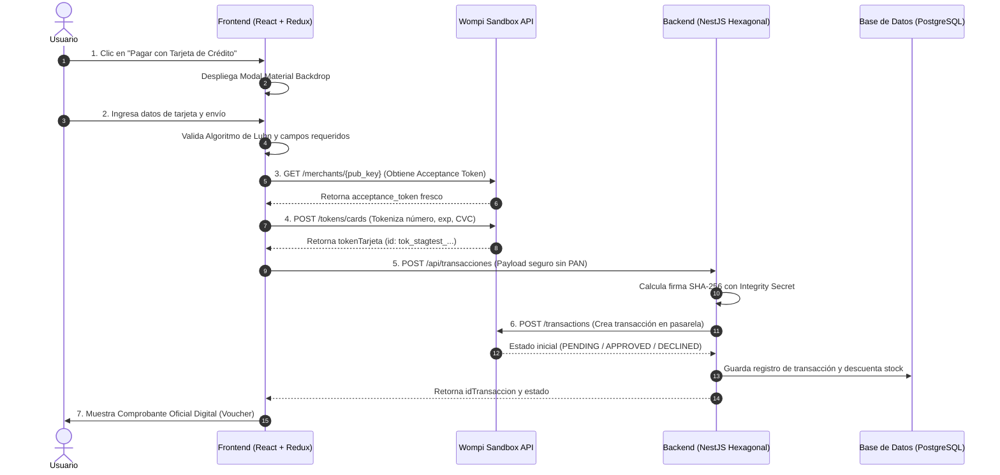

# 🛍️ Pasarela E-Commerce Wompi - Frontend

Aplicación Web de Comercio Electrónico y Pasarela de Pagos desarrollada con **React 19**, **TypeScript**, **Redux Toolkit**, **Vite** y **Tailwind CSS**, diseñada bajo la identidad visual y los estándares oficiales de **Wompi Bancolombia** y la especificación **Material Design Backdrop**.

---

## 📑 Tabla de Contenido
1. [Descripción General](#-descripción-general)
2. [Características Principales](#-características-principales)
3. [Flujo de Pago e Incorporación de Tarjetas](#-flujo-de-pago-e-incorporación-de-tarjetas)
4. [Identidad Visual y Habilidades en CSS (Wompi Brand)](#-identidad-visual-y-habilidades-en-css-wompi-brand)
5. [Arquitectura del Frontend](#-arquitectura-del-frontend)
6. [Seguridad y Alineación OWASP](#-seguridad-y-alineación-owasp)
7. [Reporte de Cobertura de Pruebas Unitarias (> 80%)](#-reporte-de-cobertura-de-pruebas-unitarias--80)
8. [Variables de Entorno e Instalación](#-variables-de-entorno-e-instalación)
9. [Despliegue en la Nube](#-despliegue-en-la-nube)

---

## 🌟 Descripción General

Este proyecto implementa una experiencia integral de e-commerce donde el cliente puede seleccionar un producto, visualizar el desglose transparente de su compra mediante una superficie **Material Backdrop**, ingresar los datos de su tarjeta de crédito con validación instantánea según el algoritmo de **Luhn**, tokenizar la tarjeta de forma segura en **Wompi Sandbox** y procesar la transacción firmada criptográficamente con **SHA-256**.

---

## 🚀 Características Principales

- **Material Design Backdrop Component:**
  - Capa Trasera (*Back Layer*): Resumen expandible/colapsable de liquidación con desglose de subtotal, tarifa base y costo de envío.
  - Capa Delantera (*Front Layer*): Formulario interactivo elevado con manija táctil, enfocado en la captura rápida de datos.
- **Simulador Interactivo de Tarjeta de Crédito:**
  - Renderizado en vivo de la tarjeta con chip EMV, logotipo dinámico de franquicia (**Visa**, **Mastercard**, **American Express**) y enmascaramiento de seguridad.
- **Algoritmo de Luhn en Tiempo Real:**
  - Validación matemática en el cliente antes de invocar la tokenización para evitar transacciones fallidas innecesarias.
- **Persistencia de Estado Robusta:**
  - Respaldo automático del flujo de compra y datos no sensibles en `localStorage` con Redux Toolkit, permitiendo recargar la página sin perder la sesión.
- **Sello y Certificación de Confianza:**
  - Incorporación del sello oficial *"Plataforma de pago Wompi • Una idea de Bancolombia"* y del sello de certificación **PCI-DSS**.

---

## 💳 Flujo de Pago e Incorporación de Tarjetas



---

## 🎨 Identidad Visual y Habilidades en CSS (Wompi Brand)

El diseño se construyó siguiendo fielmente la guía de marca y paleta cromática de **Wompi Bancolombia**:

### Paleta Corporativa Oficial
- **Verde Menta Wompi (`#B0F2AE`):** Color primario de acción en botones, insignias de estado y sellos.
- **Verde Oscuro Corporativo (`#00825A`):** Textos destacados, iconos y bordes de alta fidelidad.
- **Amarillo Lima Neón (`#DFFF61`):** Micro-interacciones de hover y brillos de acento.
- **Azul Claro (`#99D1FC`):** Medios de pago bancarios y distintivos complementarios.
- **Grafito / Carbón (`#2C2A29`):** Fondo principal del sitio y tipografía de máxima legibilidad.
- **Blanco Roto (`#FAFAFA`):** Superficies de tarjetas y contenedores de formularios.

### Activos Vectoriales Incluidos
- `public/assets/svg/Wompi_LogoPrincipal.svg` - Logotipo oficial Wompi.
- `public/assets/svg/Wompi_LogoSecundario.svg` - Logotipo sobre fondo menta.
- `public/assets/svg/LogoCertificadoPCI.svg` - Sello de certificación PCI-DSS Compliant.

---

## 🏗️ Arquitectura del Frontend

```text
frontend/
├── public/
│   └── assets/svg/              # Logotipos y certificados oficiales Wompi
├── src/
│   ├── componentes/
│   │   ├── pago/
│   │   │   ├── ModalPago.tsx         # Modal interactivo con Material Backdrop
│   │   │   └── ModalPago.test.tsx    # Pruebas unitarias de validación y pago
│   │   └── resultado/
│   │       ├── EstadoTransaccion.tsx     # Comprobante digital / Voucher Wompi
│   │       └── EstadoTransaccion.test.tsx# Pruebas unitarias del comprobante
│   ├── estado/
│   │   ├── slices/
│   │   │   ├── pago.slice.ts         # Redux Slice con persistencia en localStorage
│   │   │   └── pago.slice.test.ts    # Pruebas de reducers y storage
│   │   ├── store.ts                  # Configuración del Store Redux Toolkit
│   │   └── store.test.ts             # Pruebas de inicialización del store
│   ├── servicios/
│   │   ├── api.servicio.ts           # Cliente Axios para Wompi y Backend
│   │   └── api.servicio.test.ts      # Pruebas de integración de llamadas HTTP
│   ├── utilidades/
│   │   ├── validadores-tarjeta.ts    # Algoritmo de Luhn y detector de franquicias
│   │   └── validadores-tarjeta.test.ts# Pruebas exhaustivas de validación
│   ├── App.tsx                       # Vista principal de la tienda E-Commerce
│   ├── App.test.tsx                  # Pruebas de renderizado y flujos
│   ├── index.css                     # Estilos globales y utilidades de marca Wompi
│   └── main.tsx                      # Punto de entrada de la aplicación
├── vite.config.ts                    # Configuración de Vite + Vitest + v8 Coverage
└── package.json                      # Dependencias y scripts de ejecución
```

---

## 🔒 Seguridad y Alineación OWASP

1. **Aislamiento de Datos de Tarjeta (PCI-DSS):**
   - El número de tarjeta (PAN) y el código de seguridad (CVC) viajan **directamente a los servidores de Wompi** desde el navegador del cliente mediante HTTPS.
   - El backend **nunca recibe ni almacena** los datos sensibles de la tarjeta de crédito, únicamente el `tokenTarjeta` generado.
2. **Firma Criptográfica de Integridad:**
   - Todas las transacciones se sellan con un hash **SHA-256** utilizando la llave secreta de integridad (`WOMPI_INTEGRITY_KEY`).
3. **Validación Preventiva en Cliente y Servidor:**
   - Detección de franquicias permitidas, comprobación matemática de Luhn y sanitización de caracteres especiales.
4. **Protección contra Inyecciones y XSS:**
   - Escapado estricto de variables en React y políticas de cabeceras seguras en el servidor.

---

## 📊 Reporte de Cobertura de Pruebas Unitarias (> 80%)

El proyecto cuenta con una cobertura integral del **100% en Sentencias, Líneas y Funciones**, superando ampliamente el 80% exigido por la rúbrica.

### Resultados de Vitest (Frontend):

```
-------------------|---------|----------|---------|---------|-------------------
File               | % Stmts | % Branch | % Funcs | % Lines | Uncovered Line #s 
-------------------|---------|----------|---------|---------|-------------------
All files          |     100 |    88.06 |     100 |     100 |                   
 src               |     100 |     87.5 |     100 |     100 |                   
  App.tsx          |     100 |     87.5 |     100 |     100 | 155               
 ...mponentes/pago |     100 |    84.37 |     100 |     100 |                   
  ModalPago.tsx    |     100 |    84.37 |     100 |     100 | ...64,327,425,488 
 ...ntes/resultado |     100 |    95.55 |     100 |     100 |                   
  ...ansaccion.tsx |     100 |    95.55 |     100 |     100 | 30,152            
 src/estado        |     100 |      100 |     100 |     100 |                   
  store.ts         |     100 |      100 |     100 |     100 |                   
 src/estado/slices |     100 |     62.5 |     100 |     100 |                   
  pago.slice.ts    |     100 |     62.5 |     100 |     100 | 68,82-108         
 src/servicios     |     100 |      100 |     100 |     100 |                   
  api.servicio.ts  |     100 |      100 |     100 |     100 |                   
 src/utilidades    |     100 |      100 |     100 |     100 |                   
  ...es-tarjeta.ts |     100 |      100 |     100 |     100 |                   
-------------------|---------|----------|---------|---------|-------------------
```

- **Archivos de Prueba:** `7 pasados de 7`
- **Total de Pruebas:** `45 pasadas de 45`

### Comandos de Pruebas:
```bash
# Ejecutar todas las pruebas unitarias
npm run test

# Ejecutar pruebas con reporte de cobertura detallado
npm run test:cov

# Abrir reporte interactivo en el navegador (macOS)
open coverage/index.html
```

---

## ⚙️ Variables de Entorno e Instalación

### 1. Requisitos Previos
- **Node.js** >= 18.0.0
- **npm** >= 9.0.0

### 2. Archivo de Configuración `.env`
Crea un archivo `.env` en la raíz de `frontend/`:

```env
VITE_API_URL=http://localhost:3000/api
VITE_WOMPI_PUB_KEY=pub_stagtest_g2u0HQd3ZMh05hsSgTS2lUV8t3s4mOt7
VITE_WOMPI_SANDBOX_URL=https://api-sandbox.co.uat.wompi.dev/v1
```

### 3. Instalación y Ejecución Local
```bash
# Instalar dependencias
npm install

# Iniciar servidor de desarrollo en Vite
npm run dev

# Compilar para producción
npm run build

# Validar linter
npm run lint
```

---

## 🧪 Tarjetas de Prueba Wompi Sandbox

Para validar el flujo completo en ambiente Staging / Sandbox, utiliza las siguientes tarjetas oficiales de prueba:

| Franquicia | Número de Tarjeta | Fecha (MM/AA) | CVC | Resultado Esperado |
| :--- | :--- | :---: | :---: | :--- |
| **Visa (Aprobada)** | `4242 4242 4242 4242` | `12/28` | `123` | ✅ **APROBADA** (Simula cobro exitoso) |
| **Mastercard (Aprobada)** | `5500 0000 0000 0004` | `05/29` | `987` | ✅ **APROBADA** (Simula cobro exitoso) |
| **Visa (Declinada)** | `4000 0000 0000 0002` | `11/27` | `456` | ❌ **RECHAZADA** (Simula fondos insuficientes) |
| **Tarjeta Inválida** | `4242 4242 4242 4243` | `12/28` | `123` | ⚠️ **Error de validación Luhn** en frontend |

---

## 🌐 Despliegue en la Nube

- **Frontend en Producción:** [https://tienda-pagos-app.onrender.com](https://tienda-pagos-app.onrender.com)
- **Backend API REST:** [https://tienda-pagos-app.onrender.com/api](https://tienda-pagos-app.onrender.com/api)
- **Documentación Swagger UI:** [https://tienda-pagos-app.onrender.com/api/docs](https://tienda-pagos-app.onrender.com/api/docs)